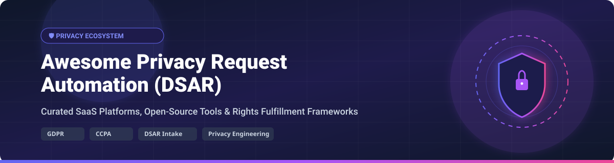

# 🛡️ Awesome Privacy Request Automation (DSAR)



<p align="center">
  <a href="https://github.com/ishandutta2007/Awesome-Awesome-Awesome"></a>
  <a href="https://discord.gg/jc4xtF58Ve"></a>
  <a href="https://github.com/ishandutta2007/Awesome-Awesome-Awesome"></a>
  <a href="https://github.com/ishandutta2007/Awesome-Privacy-Request-Automation/blob/main/LICENSE"></a>
  <a href="https://github.com/ishandutta2007/Awesome-Privacy-Request-Automation/stargazers"></a>
  <a href="https://github.com/ishandutta2007/Awesome-Privacy-Request-Automation/pulls"></a>
  <a href="https://github.com/ishandutta2007"></a>
</p>

> **A curated showcase of Data Subject Access Request (DSAR) platforms, Privacy Request Automation tools, Privacy-as-Code frameworks, and Data Governance ecosystems under GDPR, CCPA/CPRA, LGPD, and global data protection laws.**

---

## 📌 Table of Contents

- [🔍 Overview & Industry Ecosystem](#-overview--industry-ecosystem)
- [🏢 SaaS & Enterprise Platforms](#-saas--enterprise-platforms)
- [💻 Open-Source Projects & Frameworks](#-open-source-projects--frameworks)
- [🛠️ Architecture & Fulfillment Workflows](#%EF%B8%8F-architecture--fulfillment-workflows)
- [🤝 How to Contribute](#-how-to-contribute)
- [💖 Support & Sponsorship](#-support--sponsorship)
- [⚖️ Legal Disclaimer](#%EF%B8%8F-legal-disclaimer)
- [📈 Star History](#-star-history)

---

## 🔍 Overview & Industry Ecosystem

Privacy Request Automation enables organizations to receive, identity-verify, orchestrate, execute, and audit **Data Subject Access Requests (DSARs)**—including right-to-know, data deletion/erasure, rectification, opt-out, and portability requests—at enterprise scale.

### 🎯 Key Regulatory Drivers
- 🇪🇺 **GDPR (Articles 15–22)**: Access, Erasure ("Right to be Forgotten"), Data Portability, and Restriction of Processing.
- 🇺🇸 **CCPA / CPRA (California)**: Right to Know, Opt-Out of Sale/Sharing, Correct, Limit Sensitive Personal Info.
- 🇧🇷 **LGPD (Brazil)** & 🇮🇳 **DPDP Act (India)**: Data principal rights and automated compliance reporting.

---

## 🏢 SaaS & Enterprise Platforms

📊 **Market Size & Industry Structure**: The global Data Privacy & Privacy Management Software market is estimated at **$2.7B – $6.3B** (growing at a 25–42% CAGR). The sector exhibits **moderate concentration**: the top 5 vendors command ~35–42% of global market revenue, led by OneTrust, while a dynamic ecosystem of specialized entrants prevents a single "winner-take-all" outcome.

*Below, platforms are sorted by **Company Size (Revenue / Valuation)** in descending order.*

| 🏢 Platform | 💰 Starting Price | 🎁 Free Tier / Trial Limits | 📊 Company Size (Valuation / Revenue) | 📝 Core Capabilities & Focus |
| :--- | :--- | :--- | :--- | :--- |
| **[OneTrust](https://www.onetrust.com/)** 🛡️ | `$10,000 / year` ($833/mo minimum contract) | `14-day free trial` (select modules; free standalone cookie & CCPA tools) | **$5.3B Valuation** (~$500M ARR) | End-to-end privacy governance, enterprise DSAR orchestration, data discovery, AI governance. |
| **[BigID](https://www.bigid.com/)** 🔍 | `$15,000 / year` ($1,250/mo starter tier) | `30-day free trial` (available upon demo request) | **$1.0B Valuation** (~$120M ARR) | Deep data discovery, ML classification, automated DSAR fulfillment across hybrid data estates. |
| **[TrustArc](https://trustarc.com/)** 📜 | `$10,000 / year` ($833/mo starting plan) | `14-day free trial` (guided sandbox setup) | **~$82.0M ARR** ($85M+ total funding) | Comprehensive risk & compliance management, DSAR intake forms, workflow automation. |
| **[Securiti](https://www.securiti.ai/)** 🤖 | `$599 / month` ($7,188/year base plan) | `30-day free trial` (access to Data Command Center sandbox) | **~$75.9M ARR** ($261M total funding) | AI-powered Data Command Center, multi-cloud discovery, automated data rights fulfillment. |
| **[DataGuard](https://www.dataguard.com/)** 🛡️ | `$6,000 / year` ($500/mo Base package) | `14-day guided trial` (upon sales consultation) | **~$52.0M ARR** ($65M total funding) | Hybrid privacy management platform combining automated compliance software with DPO expertise. |
| **[Didomi](https://www.didomi.io/)** 🍪 | `$300 / month` ($3,600/year starter plan) | `14-day free trial` (for Didomi Console & Consent Manager) | **$500M Valuation** (~$40.0M ARR) | Consent & preference management, privacy request ticketing, cross-channel consent sync. |
| **[Privado](https://www.privado.ai/)** 💻 | `$600 / month` ($7,200/year Web Auditor) | `Free 1-time audit scan` (for Web & Mobile app code flow analysis) | **~$29.6M ARR** ($17.5M total funding) | Code-level privacy analysis, data flow mapping in CI/CD, developer-first DSAR discovery. |
| **[DataGrail](https://www.datagrail.com/)** ⚡ | `$8,000 / year` ($667/mo entry tier) | `14-day sandbox trial` (upon request) | **~$16.6M ARR** ($84.2M total funding) | No-code privacy request automation, 1,000+ SaaS connectors, real-time data mapping. |
| **[Transcend](https://transcend.io/)** 🚀 | `$10,000 / year` ($833/mo Developer tier) | `30-day developer sandbox trial` (full API & connector access) | **~$16.1M ARR** ($65M total funding) | Developer-centric privacy infrastructure, programmatic data rights, real-time data erasure. |
| **[Osano](https://www.osano.com/)** 🌐 | `$199 / month` ($2,388/year Plus plan) | `Free Forever Plan` (up to 5,000 visitors/mo, 1 domain, basic DSAR) | **~$15.0M ARR** (acquired WireWheel) | Easy-to-use cookie consent, DSAR intake portal, vendor risk management. |
| **[WireWheel](https://wirewheel.io/)** ⚙️ | `$5,000 / year` ($416/mo starter plan) | `14-day sandbox trial` (upon demo request) | **~$8.8M ARR** (acquired by Osano) | Privacy operational workflows, technical data mapping, custom request portal templates. |

---

## 💻 Open-Source Projects & Frameworks

*Below, open-source repositories are sorted by **GitHub Star Count** in descending order.*

| 📦 Repository / Project | ⭐ GitHub Stars | 🏷️ Category & Focus | ⚡ Key Highlights |
| :--- | :--- | :--- | :--- |
| **[OpenMetadata](https://github.com/open-metadata/OpenMetadata)** 🗃️ | [](https://github.com/open-metadata/OpenMetadata/stargazers) | Data Governance & Metadata | Unified context layer & automated data classification to identify PII for DSAR fulfillment. |
| **[DataHub](https://github.com/datahub-project/datahub)** 🌐 | [](https://github.com/datahub-project/datahub/stargazers) | Enterprise Data Catalog | Extensible metadata platform for tracking data lineage and locating personal data assets. |
| **[CookieConsent](https://github.com/orestbida/cookieconsent)** 🍪 | [](https://github.com/orestbida/cookieconsent/stargazers) | Consent Management | Lightweight, vanilla JS cookie consent modal supporting GDPR/CCPA compliance. |
| **[Amundsen](https://github.com/amundsen-io/amundsen)** 🔎 | [](https://github.com/amundsen-io/amundsen/stargazers) | Data Discovery Engine | Metadata-driven search engine for discovering user datasets across databases and data lakes. |
| **[CISO Assistant](https://github.com/intuitem/ciso-assistant-community)** 🛡️ | [](https://github.com/intuitem/ciso-assistant-community/stargazers) | GRC & Compliance Platform | Open-source GRC tool supporting GDPR, ISO 27001, and privacy risk assessment workflows. |
| **[Osano CookieConsent](https://github.com/osano/cookieconsent)** ⚡ | [](https://github.com/osano/cookieconsent/stargazers) | Web Consent Banner | Popular open-source JavaScript plugin for handling EU & California cookie consent requirements. |
| **[Klaro](https://github.com/kiprotect/klaro)** 🎛️ | [](https://github.com/kiprotect/klaro/stargazers) | Consent & Privacy Manager | Privacy-friendly, open-source consent manager with granular script & cookie blocking. |
| **[Laravel Cookie Consent](https://github.com/spatie/laravel-cookie-consent)** 🐘 | [](https://github.com/spatie/laravel-cookie-consent/stargazers) | Framework Plugin | Easy-to-integrate Laravel package for EU GDPR cookie compliance notices. |
| **[tarteaucitron.js](https://github.com/AmauriC/tarteaucitron.js)** 🥖 | [](https://github.com/AmauriC/tarteaucitron.js/stargazers) | GDPR Script Manager | Comprehensive JS manager for European cookie compliance and third-party script consent. |
| **[GDPR Checklist](https://github.com/privacyradius/gdpr-checklist)** 📋 | [](https://github.com/privacyradius/gdpr-checklist/stargazers) | Compliance Guide | Interactive checklist for web developers and DPOs navigating GDPR requirements. |
| **[Awesome GDPR](https://github.com/erichard/awesome-gdpr)** 📚 | [](https://github.com/erichard/awesome-gdpr/stargazers) | Curated Resource List | Broad collection of open GDPR compliance utilities, privacy policies, and security guides. |
| **[Fides](https://github.com/ethyca/fides)** ⚙️ | [](https://github.com/ethyca/fides/stargazers) | Privacy-as-Code Suite | Developer platform to declare data privacy policies and automate runtime compliance workflows. |
| **[Awesome Privacy Engineering](https://github.com/AbductiveReason/AwesomePrivacyEngineering)** 🧠 | [](https://github.com/AbductiveReason/AwesomePrivacyEngineering/stargazers) | Engineering Resources | Curated index of technical privacy-enhancing technologies (PETs) and data privacy specs. |
| **[Fidesops](https://github.com/ethyca/fidesops)** ⚡ | [](https://github.com/ethyca/fidesops/stargazers) | DSAR Orchestration Engine | Automated DSAR engine connecting databases & SaaS apps to execute access/erasure pipelines. |
| **[DSAR Open Engine](https://github.com/inthhq/dsar)** 🔧 | [](https://github.com/inthhq/dsar/stargazers) | DSAR Protocol Standard | Open programmatic standard and engine for handling data subject access requests. |
| **[DARPAL](https://github.com/DaSKITA/darpal)** 🧪 | [](https://github.com/DaSKITA/darpal/stargazers) | DSL for Privacy Automation | Experimental domain-specific language for defining data request processing pipelines. |

---

## 🛠️ Architecture & Fulfillment Workflows

```
┌─────────────────┐       ┌──────────────────────┐       ┌────────────────────────┐
│  Data Subject   │ ────► │  Intake & Identity   │ ────► │ DSAR Orchestration    │
│  (Access/Erase) │       │  Verification Portal │       │ Engine (Fides/SaaS)    │
└─────────────────┘       └──────────────────────┘       └───────────┬────────────┘
                                                                     │
                                  ┌──────────────────────────────────┴──────────────────────────────────┐
                                  ▼                                  ▼                                  ▼
                       ┌──────────────────────┐           ┌──────────────────────┐           ┌──────────────────────┐
                       │ Enterprise DBs & SQL │           │ SaaS & Cloud Apps    │           │ Storage & Data Lakes │
                       │ (Postgres, Snowflake)│           │ (Salesforce, Stripe) │           │ (AWS S3, BigQuery)   │
                       └──────────────────────┘           └──────────────────────┘           └──────────────────────┘
```

---

## 🤝 How to Contribute

Contributions are highly welcome! To add a new platform or open-source tool:

1. 🍴 **Fork** this repository.
2. ✏️ **Edit** `README.md` following the exact table structure (include specific starting prices, free tier limits, company sizes, or star badges).
3. 🚀 **Submit a Pull Request** with a brief summary of your additions.

---

## 💖 Support & Sponsorship

Thank you so much for using and exploring **Awesome Privacy Request Automation**! 🛡️

If this repository has helped you navigate the privacy automation ecosystem, saved you research time, or assisted your engineering team:
- ⭐ **Star** this repository on GitHub to show your support.
- 🍴 **Fork** it to keep a copy or contribute updates.
- 📢 **Share** it with fellow privacy engineers, DPOs, and compliance leads.

💖 **Become a Sponsor**: If you'd like to support the ongoing maintenance and curation of open-source privacy resources, consider sponsoring via the [GitHub Sponsor Dashboard](https://github.com/sponsors/ishandutta2007). Your support is greatly appreciated!

---

## ⚖️ Legal Disclaimer

*This repository is a community-curated list for informational and educational purposes only. Automated DSAR systems process sensitive personal data and interact with stringent legal frameworks. Inclusion in this list does not constitute legal endorsement or compliance advice. Always consult qualified legal counsel and privacy engineers when building or buying DSAR automation tools.*

---

## 📈 Star History

[](https://star-history.dera.page/#ishandutta2007/Awesome-Privacy-Request-Automation&type=date&legend=top-left)

---

<p align="center">
  <b>⭐ Star this repository if you find it helpful! ⭐</b>
</p>
